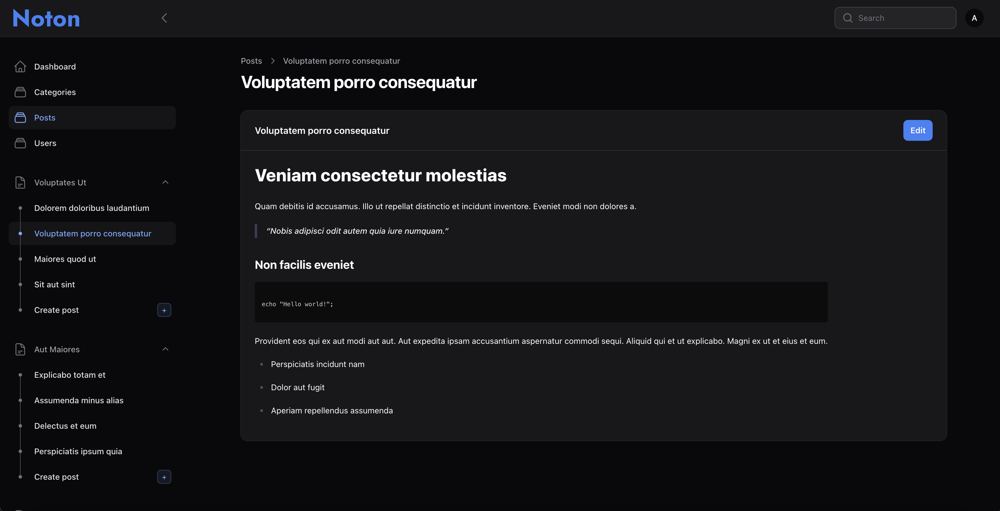
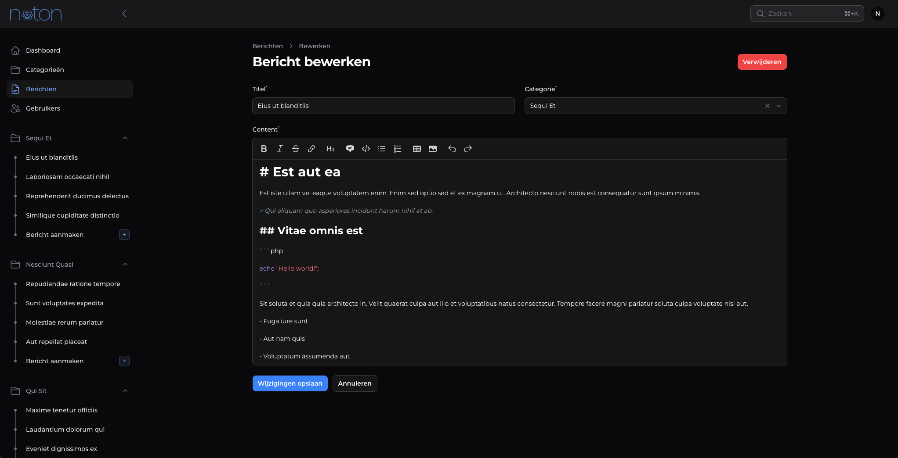

# Noton

A free and open documentation platform built with [Laravel](https://laravel.com/) and [Filament](https://filamentphp.com/), focused on clarity, structure, and self-hosted simplicity.

---

> Please note that Noton is still under active development

## Installation

Documentation for self-hosting with Docker will be added soon.

---

### Contributing

This project is under active development. Contributions are welcome.

---

## Screenshots

