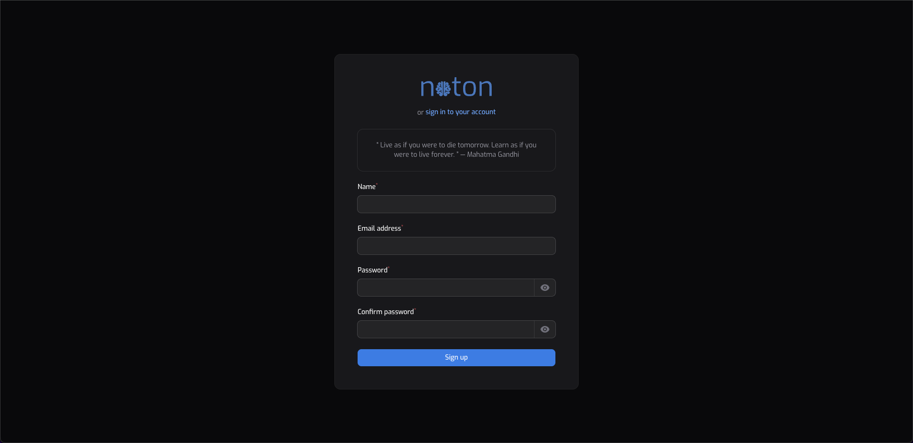

    

A free and open documentation platform built with [Laravel][laravel] and [Filament][filament], enhanced by [Ollama][ollama] for local AI features, focused on clarity, structure, and self-hosted simplicity.

---

> Please note that **Noton** is still under active development

## Installation

See [setup instructions][setup] for how to self-host Noton with [Docker][docker] or run it locally.

## Local AI

Noton integrates with [Ollama][ollama] to provide **private**, local AI features.
All prompts and answers stay on your own server – no external API calls are made.

> Please note that AI models are resource-intensive, you may need to choose a model that fits your host

---

### License

Noton is licensed under the _Functional Source License, Version 1.1_. It's free to use for
internal and non-commercial purposes, but it's not allowed to use a release for commercial purposes (competing use). See our [full license][license] for more details.

### Contributing

This project is under active development. Contributions are welcome.

---

## Screenshots

.png)
.png)
.png)
.png)

[laravel]: https://laravel.com
[filament]: https://filamentphp.com
[ollama]: https://ollama.com/
[setup]: docs/setup.md
[docker]: https://www.docker.com/
[license]: LICENSE.md
